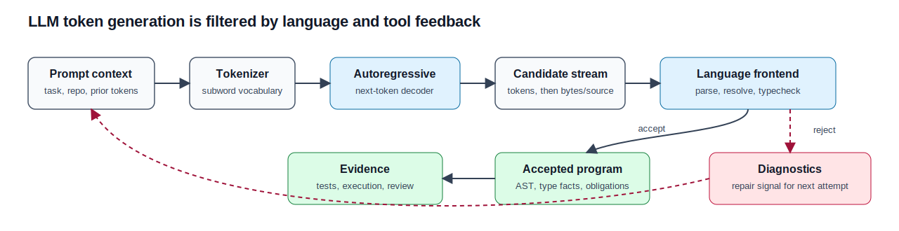
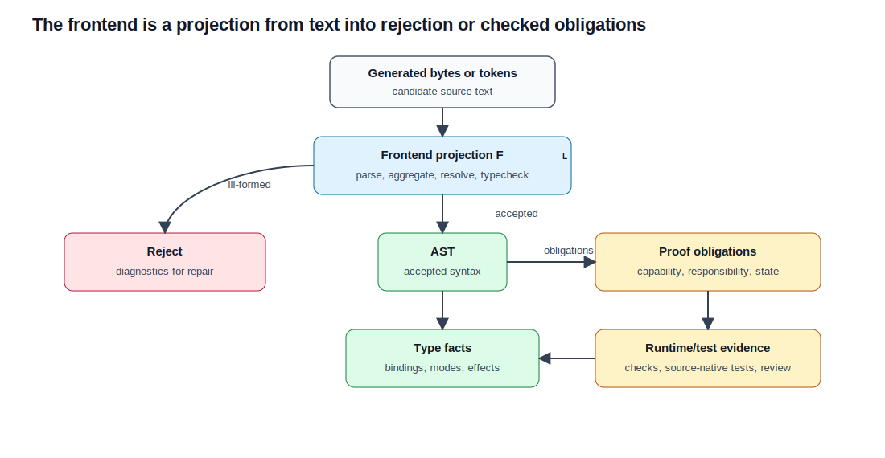
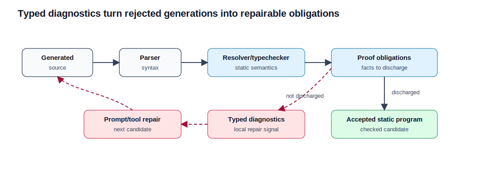
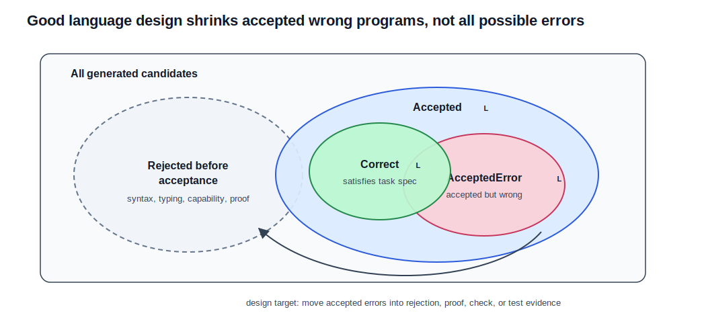
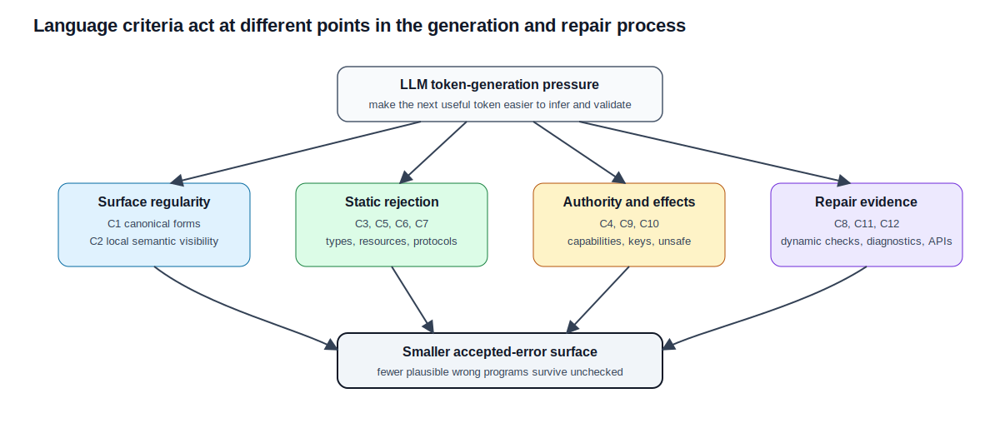
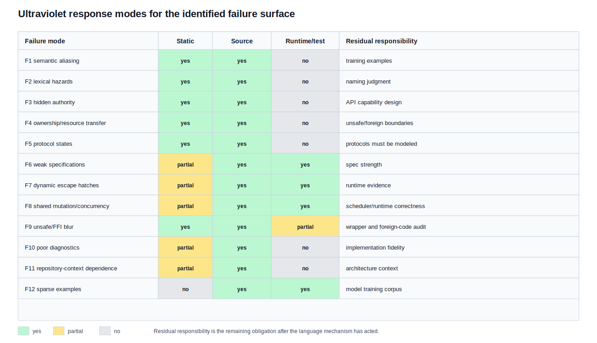

# What Makes a Programming Language Good or Bad for LLM Code Generation

## A decoder-centric and type-theoretic account, with an Ultraviolet mapping

Date: 2026-05-20

Status: research paper and design analysis. This paper is not a compiler
implementation audit. The Ultraviolet claims below are claims about mechanisms
specified in the current `Docs/SPECIFICATION.md`, not claims that every mechanism
is already fully implemented.

## Abstract

Large language models generate programs as token sequences. They do not natively
generate abstract syntax trees, typing derivations, ownership proofs, capability
proofs, or test-passing executions; those artifacts exist only when the language,
tooling, prompt, or decoding procedure makes them available. A programming
language is therefore good for LLM-assisted coding when its surface syntax and
static semantics do two things at once. First, they make the correct continuation
more probable by placing the relevant type, state, ownership, authority, and
contract facts in the local token context before the model must choose the next
construct. Second, they reject, diagnose, or dynamically check candidates that
still omit those obligations. It is bad when it hides the facts that determine
the next correct token, allows many source forms for the same semantic act,
leaves ownership and protocol state implicit, accepts unchecked dynamic behavior,
or reports failures too late and too diffusely for iterative repair.

The paper derives these criteria from three bodies of evidence: transformer and
autoregressive language-model mechanics; empirical code-generation results such
as Codex/HumanEval, AlphaCode, MultiPL-E, Code Llama, StarCoder, SWE-bench, and
security studies of generated code; and type-theoretic results on type
soundness, propositions-as-types, linear/resource types, session/protocol types,
and refinement types. The main conclusion is not that a language can make LLMs
reliable by itself. The defensible conclusion is narrower: language design can
reduce the accepted error surface and improve feedback density by aligning
program text with the semantic obligations that the model would otherwise have
to infer from remote context or unstated convention. More constructively, a
language can increase the probability mass assigned to correct continuations by
canonicalizing equivalent operations, making discriminating facts local, placing
obligation markers before dependent subterms, and using type-directed constructs
whose legal continuations are narrow and visible.

Ultraviolet directly addresses many of the identified language-induced failure
modes through its "One Correct Way", local reasoning, explicit-over-implicit,
static-by-default design contract; capability-based no-ambient-authority rules;
responsibility and permission state; modal types; refinement types; contracts
and invariants; source-native tests; explicit `#dynamic`; key-mediated shared
access; and explicit unsafe/FFI boundaries. Ultraviolet does not solve model
training scarcity, repository retrieval, algorithm invention, library knowledge,
or the remaining proof obligations at unsafe and foreign boundaries.

Keywords: large language models, program synthesis, programming-language design,
type theory, type soundness, refinement types, linear types, modal types,
capability security, Ultraviolet.

## 1. Research Question

The question is not "which existing language has the highest benchmark score?"
That question is empirical, model-dependent, training-set-dependent, and changes
as models and corpora change.

The stable question is:

> What properties of a programming language make the token-by-token generation
> process more likely to produce code that is syntactically valid,
> statically accepted for the right reasons, semantically aligned with the task,
> secure at authority boundaries, and repairable when it is wrong?

This question has a language-design answer only in the language-induced part of
the problem. An LLM can still fail because the prompt is underspecified, the
repository context is missing, the model lacks training data, the task requires
new algorithms, or the tool loop is weak. A good language cannot remove those
failures. It can make fewer failures silently accepted as plausible code.

## 2. Method and Evidence Standard

The paper uses four evidence classes.

1. Decoder mechanics. Transformer and GPT-style models estimate a conditional
   distribution over next tokens. This is the mechanism that language syntax and
   naming interact with directly.
2. Empirical code-generation evidence. Benchmarks and studies show what current
   or recent code models can and cannot do: single-function synthesis, repeated
   sampling, behavior filtering, multilingual transfer, repository-scale issue
   repair, and security-sensitive generation.
3. Type theory and programming-language metatheory. Type soundness, refinements,
   linear/resource typing, propositions-as-types, and session/protocol typing
   explain which classes of invalid programs can be excluded before execution
   and which require stronger specifications or runtime evidence.
4. Ultraviolet specification evidence. The Ultraviolet mapping cites named
   rules and sections in `Docs/SPECIFICATION.md`; it does not infer properties
   from marketing language or implementation intent.

Claims are classified as follows.

Empirical claims are tied to the cited paper or benchmark. Formal claims are
derived from definitions in this paper plus standard type-theoretic results.
Ultraviolet claims are tied to the current specification. When the paper states
that Ultraviolet "addresses" a failure mode, it means the specification contains
a mechanism that narrows, rejects, localizes, or makes explicit that failure
mode. It does not mean the mechanism guarantees successful LLM task completion.

## 3. The LLM Generation Model

### 3.1 Autoregressive generation

Let $V$ be a finite tokenizer vocabulary. Given a prompt $p$ and previously
generated tokens $t_{< i}$, an autoregressive language model parameterized by
$\theta$ computes a distribution:

$$
P_{\theta}(t_{i} \mid p, t_{1}, \ldots, t_{i-1})
$$

Decoding then selects the next token by greedy choice, beam search, sampling, or
another policy. The transformer architecture introduced by Vaswani et al. uses
attention over token representations [Vaswani2017]. GPT-3 is explicitly
described as an autoregressive language model applied through text interaction
without gradient updates at evaluation time [Brown2020].

For programming, the critical point is that the primitive generated object is a
token sequence, not a typed program. The compiler, parser, typechecker, tests,
runtime, or constrained decoder must supply the missing structure.

Figure 1 shows the basic pipeline this paper assumes. The model proposes token
continuations; the language frontend and tool loop decide which candidates
become accepted programs, diagnostics, or runtime/test evidence.

### 3.2 Tokenization is not the language grammar

Modern LLMs commonly use subword tokenization, including byte-pair encoding
variants [Sennrich2016] or language-independent subword tokenizers such as
SentencePiece [Kudo2018]. Subword tokenization solves open-vocabulary modeling
problems, but it does not know that a language token is an identifier, keyword,
operator, lifetime marker, capability marker, ownership marker, or contract
relation. A model may learn those regularities statistically; the tokenizer
itself does not enforce them.

This creates a first design pressure:

> A programming language good for LLM generation should make important semantic
> commitments visible in short, stable, repeated lexical patterns, while the
> compiler remains the authority for validity.

The language should not depend on the LLM "understanding" a hidden semantic
convention that has no stable surface marker and no static check.

### 3.3 The language frontend as a projection

Let a language frontend be a partial function:

$$
F_{L} :
\mathrm{Bytes}
\rightharpoonup
\mathrm{Reject}(\mathrm{Diagnostic}^{*})
\mid
\mathrm{Accept}(\mathrm{AST}, \mathrm{TypeFacts}, \mathrm{Obligations})
$$

The LLM proposes bytes or tokens. The frontend projects those bytes into a
program plus facts, or rejects them with diagnostics. If $F_{L}$ rejects early,
precisely, and deterministically, the model or agent can repair. If $F_{L}$
accepts a program whose important obligations were omitted, the error has moved
from a cheap syntactic/static correction into a semantic, runtime, security, or
review problem.

Language design affects $F_{L}$ in three ways:

1. It shapes the token sequences that are accepted.
2. It determines which obligations become explicit source constructs.
3. It determines which violations produce local diagnostics rather than latent
   behavior.

Figure 2 makes the projection role explicit. A language feature is useful for
LLM coding only if it changes the path from candidate text to acceptance,
diagnosis, proof, runtime check, or executable evidence.

### 3.4 Constructive token steering

The previous section describes the frontend as a filter. That is necessary, but
it is not enough to explain what makes a language good for LLM coding. The
constructive question is:

> What can a language put in the token stream so that the model is more likely
> to choose the correct next token before any rejection occurs?

Let $c_{i}=(p,t_{1},\ldots,t_{i-1})$ be the visible decoding context before the
next token. Let $A_{L}(c_{i}) \subseteq V$ be the token continuations that can
still lead to an accepted program in language $L$, and let
$C_{L}(c_{i},O) \subseteq A_{L}(c_{i})$ be the continuations that also preserve
the relevant obligation $O$ for the current task. That obligation may be an
expected type, required capability, receiver state, ownership transfer,
permission mode, postcondition, key mode, or unsafe/foreign boundary.

The immediate probability that decoding takes a correct step is:

$$
P_{\theta}\!\left(C_{L}(c_{i},O) \mid c_{i}\right)
    =
    \sum_{v \in C_{L}(c_{i},O)}
        P_{\theta}(v \mid c_{i}).
$$

Language design can improve this probability in two different ways.

1. It can shrink $A_{L}(c_{i})$ by making fewer continuations syntactically or
   statically legal. This is the rejection/filtering side.
2. It can move probability mass from $A_{L}(c_{i}) \setminus C_{L}(c_{i},O)$
   into $C_{L}(c_{i},O)$ by making the obligation visible and conventional in
   the preceding context. This is the token-steering side.

The second mechanism is the one the earlier draft under-explained. An LLM does
not choose the "semantically correct construct" directly. It chooses a token
whose logit is a function of patterns in $c_{i}$. A language can therefore help
only when the source text before the choice contains tokens that are predictive
of the right construct. The useful design variable is not just "is the program
rejected later?" but "does the source prefix encode the fact that distinguishes
the correct continuation from plausible wrong continuations?"

This can be stated as a local-information criterion. Let $H_{i}$ be the hidden
semantic fact needed to choose the next correct construct, such as "this value
has been moved", "the receiver is in state Open", "this call requires network
authority", or "this write requires a write key." A language is better for LLM
generation when it turns $H_{i}$ into source-visible evidence $E_{i}$ in or near
the context:

$$
I(T_{i};H_{i}\mid c_{i})
\quad\text{is hard for the model to use when }H_{i}\text{ is absent from }c_{i},
$$

but

$$
I(T_{i};E_{i}\mid c_{i})
\quad\text{can guide decoding when }E_{i}\text{ is present as source text.}
$$

This is not a claim that LLMs explicitly compute mutual information. It is a
claim about what the conditional distribution can use. If the fact that
distinguishes the correct token is absent, remote, implicit, or encoded only in
unstated convention, the model must infer it from weaker correlations. If the
fact is present as a stable token pattern before the decision point, training
examples and in-context examples can associate that pattern with the correct
continuation.

The constructive language patterns are therefore:

Prefix markers. The marker for a semantic regime should appear before the region
whose tokens depend on that regime. A write-key block, move marker, dynamic
verification marker, contract clause, receiver permission, or modal transition
is useful to the model because it appears before the dependent body, call, or
method set is generated.

Canonical encodings. If one semantic act has many equivalent spellings, the
model's probability mass is split among them. If the language accepts one
canonical spelling, examples concentrate on the same token path and the model
has fewer plausible alternatives to rank.

Typed affordances. A receiver type, parameter mode, return type, or state type
should narrow the valid next names and argument shapes. The model may not hold a
formal typing derivation internally, but it can learn that after a particular
receiver/state/signature pattern, only a small family of method names, argument
modes, or postconditions usually follows.

Local signatures. The tokens that determine legality should be close to the use
site. Attention lets a transformer relate distant tokens, but distance still
competes with other context. A narrow signature that carries authority,
permission, ownership, and contract information gives the decoder better local
evidence than a broad context object whose relevant fact is buried elsewhere.

Executable correction. Diagnostics and tests affect later decoding turns by
becoming new prompt tokens. A diagnostic that names the missing capability,
state, move, key, or proof obligation gives the next generation attempt a
high-information prefix. A vague runtime failure does not.

Claim 1. A language construct encourages correct LLM output when it satisfies
all three conditions: it is visible before the dependent choice, it is associated
with a narrow set of legal continuations, and the compiler or runner preserves
the association by rejecting or diagnosing inconsistent continuations.

Argument. The model samples from $P_{\theta}(t_{i}\mid c_{i})$. A hidden rule
cannot affect this distribution except through correlations already present in
$c_{i}$. A visible construct changes $c_{i}$. If the construct is canonical, the
training and prompt evidence for the relevant semantic act is concentrated. If
the construct narrows legal continuations, tool-assisted decoding, compiler
diagnostics, and repair prompts can distinguish the correct token family from
nearby wrong families. If inconsistent continuations are still accepted, the
construct becomes decorative and does not reduce the accepted-error set. The
three conditions are therefore jointly necessary for a construct to steer
generation reliably rather than merely describe intent.

### 3.5 Claim: syntax validity is necessary but insufficient

Claim 2. A grammar-constrained decoder can reduce syntactically invalid output,
but grammar constraints alone cannot ensure ownership safety, authority safety,
protocol sequencing, semantic postconditions, or security-sensitive behavior
unless those properties are encoded in the grammar itself.

Argument. A grammar defines a set of well-formed token sequences. Ownership,
authority, protocol state, and semantic postconditions quantify over bindings,
types, effects, state transitions, values, or executions. Two programs can share
the same grammar class while differing in whether a resource was moved twice,
whether a capability is available, whether a socket is open, whether a bound is
proved, or whether an output is sanitized. Therefore syntax constraints can only
remove syntax errors unless the language also has static semantics or runtime
checks that reject those deeper violations.

PICARD is empirical support for the syntax part of this claim: it constrains
autoregressive decoders with incremental parsing to reject inadmissible tokens
for formal languages such as SQL [Scholak2021]. It improves validity, but it is
a parsing method, not a proof that arbitrary semantic obligations are satisfied.

## 4. What Code Generation Evidence Shows

### 4.1 Code is statistically learnable, but correctness is not mere naturalness

The "naturalness of software" result established that source code has repetitive
statistical structure that language models can exploit [Hindle2012]. This helps
explain why LLMs can generate plausible code. It does not imply that plausible
code is correct code. Human-written code is repetitive; it is also full of bugs,
vulnerabilities, partial conventions, legacy APIs, and project-local idioms.

Good language design should exploit naturalness without mistaking naturalness
for a correctness criterion. Stable names and repeated idioms help generation.
Static checking and executable evidence decide whether the generated code is
acceptable.

### 4.2 Single-function synthesis is easier than real software repair

Codex demonstrated that a GPT model fine-tuned on public GitHub code can solve
nontrivial Python functions from docstrings. The paper reports 28.8% pass@1 on
HumanEval for the evaluated model, 70.2% with 100 samples per problem, and
limitations on long operation chains and binding operations [Chen2021]. This
matters for language design because repeated sampling is a search procedure over
text, and the compiler/test loop acts as the filter.

AlphaCode gives a stronger version of the same lesson. It achieved competitive
programming performance using large-scale transformer sampling followed by
filtering based on program behavior. The reported system depended not only on
the model but also on extensive data, efficient sampling, and behavior-based
selection [AlphaCode2022].

SWE-bench moves the task from isolated functions to repository-scale issue
repair. It requires understanding and coordinating changes across functions,
classes, and files. The original benchmark paper reported very low resolution
rates for then-frontier systems, showing that real-world coding failures are
often context, integration, and reasoning failures, not only next-token syntax
failures [Jimenez2023].

### 4.3 Language frequency and benchmarks matter

MultiPL-E translated common code-generation benchmarks into many languages and
showed that model performance can vary across languages [Cassano2022]. Code
Llama and StarCoder further show that code-specific pretraining, infilling
objectives, context length, and training corpus composition materially affect
coding performance [Roziere2023] [Li2023StarCoder].

This evidence creates an important limitation for any new language:

> Even an excellently designed language may be hard for an LLM if the model has
> seen little correct code in that language.

The best language-design response is not to imitate a popular language
uncritically. It is to provide canonical syntax, explicit obligations,
high-quality examples, deterministic diagnostics, and tool loops that let a
model repair from compiler evidence.

### 4.4 Security-sensitive generation exposes hidden-obligation failures

Pearce et al. found that a substantial fraction of Copilot-generated programs in
security-relevant scenarios were vulnerable. That result should not be read as a
permanent percentage for all models, but it is direct evidence that plausible
code generation can miss security obligations [Pearce2021].

Security failures are especially important for language design because many of
them arise from hidden authority, unchecked input trust, unsafe defaults, weak
API boundaries, and missing proof obligations. A language cannot prove all
security goals automatically, but it can prevent ambient authority, mark unsafe
boundaries, require capability values, and make dangerous conversions explicit.

## 5. Type-Theoretic Basis

### 5.1 Type systems as accepted-error reducers

Pierce defines a type system as a syntactic method for automatically checking
the absence of certain erroneous behaviors by classifying program phrases
according to the kinds of values they compute [Pierce2002]. Wright and
Felleisen's syntactic approach to type soundness gives the standard
progress/preservation shape: well-typed programs do not get stuck in the
specified ways, and evaluation preserves typing [WrightFelleisen1994].

For LLM coding, this means:

$$
\begin{aligned}
\text{generation} &\longrightarrow \text{candidate source},\\
\text{type checking} &\longrightarrow
    \text{removal of candidates outside the static language},\\
\text{type soundness} &\longrightarrow
    \text{the specified runtime errors excluded by the checker}.
\end{aligned}
$$

Figure 3 shows the type-theoretic repair loop. The central point is that the
loop improves only when the checker emits obligations and diagnostics that are
close enough to the generated source for the next attempt to use them.

The checker cannot exclude errors that are outside the type system's stated
property. A type-safe language can still compute the wrong answer, leak
authority through a permitted API, or satisfy a weak specification.

### 5.2 Propositions-as-types and contracts

The propositions-as-types correspondence connects programs, types, and proofs:
under the correspondence, a program inhabiting a type can be read as evidence
for the proposition represented by that type [Wadler2015]. In practical
programming-language design, this motivates moving important claims from
comments into type, contract, refinement, invariant, or proof obligations.

For LLM-generated code, this matters because comments are weak evidence. They
can guide the model, but unless the compiler checks them, they do not reduce the
accepted-error set. A contract or refinement can.

### 5.3 Linear/resource typing

Linear logic restricts arbitrary duplication and discarding of assumptions in
proof contexts [Girard1987]. In programming-language terms, linear or affine
type disciplines can model resources that must be used once, not duplicated, or
not used after transfer. This is directly relevant to LLM coding because
resource mistakes often arise from plausible local continuations: using a moved
value again, forgetting a release, double-freeing, aliasing mutable state, or
treating a borrowed resource as owned.

If the language marks transfer and responsibility explicitly, the model has a
token-level cue and the compiler has a static obligation. If the language hides
transfer behind convention, the model must infer a non-local fact from context.

### 5.4 Session/protocol typing and modal state

Session types show how communication protocols can be expressed as types that
constrain legal interaction sequences [Honda1998] [CairesPfenning2010]. More
generally, typestate and modal types encode lifecycle state in the type of a
value: an operation available in one state is not available in another.

For LLM generation, this changes the problem from "remember which boolean flag
means the resource is open" to "generate code whose receiver type is in the
state that exposes the desired operation." The compiler can then reject invalid
operation order.

### 5.5 Refinement types

Liquid types and related refinement systems attach logical predicates to base
types, often using decidable fragments and solver support [Rondon2008]. They
are important because many correctness obligations are not just shape
obligations:

$$
\begin{aligned}
i &< \mathrm{length},\\
\mathrm{balance} &\ge 0,\\
\mathrm{capacity} &\ge \mathrm{requested},\\
\mathrm{result} &= \mathrm{old}(x) + \Delta.
\end{aligned}
$$

For LLM coding, refinements turn some semantic obligations into local proof
or dynamic-check obligations. They do not make arbitrary program correctness
decidable. They do make a useful subset explicit and machine-checkable.

## 6. Formal Criteria for LLM-Friendly Language Design

Let $\mathrm{Task}$ be the intended programming task,
$\mathrm{Spec}_{\mathrm{Task}}$ the intended behavior, and $L$ a language.
Define:

$$
\begin{aligned}
\mathrm{Accepted}_{L}
    &= \{\,s \mid F_{L}(s)=\mathrm{Accept}(\ldots)\,\},\\
\mathrm{Correct}_{L}(\mathrm{Task})
    &= \{\,s \in \mathrm{Accepted}_{L}
        \mid s \models \mathrm{Spec}_{\mathrm{Task}}\,\},\\
\mathrm{AcceptedError}_{L}(\mathrm{Task})
    &= \mathrm{Accepted}_{L} \setminus \mathrm{Correct}_{L}(\mathrm{Task}).
\end{aligned}
$$

Figure 4 is the paper's error-surface model. The language cannot make all
generated candidates correct. It can reject more invalid candidates before
acceptance and can expose more remaining obligations as proof, check, or test
targets.

A language feature improves LLM-assisted coding when, for a meaningful class of
tasks, it does at least one of the following without introducing larger
uncheckable obligations:

1. Increases $P_{\theta}(C_{L}(c_{i},O)\mid c_{i})$ by making the obligation
   visible before the dependent token choice.
2. Reduces the branching factor of plausible accepted continuations when the
   semantic act is fixed.
3. Shrinks $\mathrm{AcceptedError}_{L}(\mathrm{Task})$.
4. Moves errors from runtime/review time to compile time.
5. Localizes diagnostics near the token span that caused the violation.
6. Makes semantic obligations visible in source before the model must satisfy
   them.
7. Preserves enough static information for repair after a failed candidate.

This definition deliberately does not equate "good" with "short", "popular",
"dynamically flexible", or "easy to emit superficially." A language can be easy
to emit and bad for reliable LLM coding if it accepts many plausible but wrong
programs.

### 6.1 Claim: explicit checked obligations dominate implicit conventions

Claim 3. For an obligation class $O$, if a language requires an explicit marker
or proof object for every accepted program that performs an $O$-sensitive
action, and rejects programs without that marker/proof, then omission of the
marker by an LLM cannot produce an accepted $O$-violating program of that form.
If the same obligation is only a convention, omission can be accepted.

Proof. In the checked language, by assumption, $F_{L}$ rejects the candidate when
the marker/proof is absent. Therefore the candidate is not in
$\mathrm{Accepted}_{L}$ and cannot be in $\mathrm{AcceptedError}_{L}$. In the
convention-only language, $F_{L}$ has no
rule that rejects absence of the convention, so there exist syntactically valid
programs in $\mathrm{Accepted}_{L}$ that omit it. Whether any particular sample
is wrong depends on the task, but the language has not excluded the error class.

This is the central reason explicit capabilities, explicit transfer, explicit
unsafe, explicit dynamic verification, and checked contracts matter for LLM code.
It is also a token-steering reason: the explicit marker gives the decoder a
source-visible prefix that predicts the family of legal continuations.

### 6.2 Claim: canonical surface forms reduce semantic aliasing

Claim 4. Holding semantics constant, a language with fewer accepted source forms
for the same semantic operation gives both the model and the reviewer a smaller
equivalence class to learn, generate, and audit.

Argument. If a semantic operation $o$ can be expressed by forms
$f_{1}, \ldots, f_{n}$,
then training evidence, examples, generated candidates, and diagnostics can be
distributed across those forms. If only one accepted form exists, evidence
concentrates. The claim is not that one form is always better than many; the
claim is conditional on semantic equivalence. Distinct forms remain justified
when they express distinct ownership, authority, synchronization, dynamic, ABI,
layout, or diagnostic behavior.

## 7. Failure Modes of Languages for LLM Coding

The following failure modes are language-induced or language-amplified. They do
not cover every reason an LLM can fail.

### F1. Semantic aliasing

A language is worse for LLM coding when it accepts many syntactic encodings of
the same semantic act without a semantic distinction. The model must learn more
surface variation, examples fragment across styles, and reviewers must ask
whether a difference is meaningful.

Good design: one accepted form where possible; distinct forms only when they
change type, authority, ownership, synchronization, dynamic checks, ABI/layout,
or diagnostics.

### F2. Tokenization-hostile lexical design

Lexical hazards include visually confusable identifiers, mixed scripts,
invisible control characters, context-sensitive tokenization, and operators
whose meaning is hard to distinguish from common punctuation. LLMs can emit
bytes that look plausible but parse differently, especially in generated patches.

Good design: deterministic tokenization, maximal-munch rules, reserved names for
semantic predicates, and diagnostics for confusable or unsafe Unicode.

### F3. Hidden authority and ambient effects

If a program can perform IO, network, heap, system, time, or execution-domain
effects without explicit capability flow, an LLM can accidentally introduce
effects by selecting a convenient API. Reviewers must search globally for hidden
authority.

Good design: no ambient authority; explicit capability-bearing values; call
rules that require the caller to possess the callee's capability requirements.

### F4. Implicit ownership and resource transfer

LLMs frequently generate locally plausible code. Resource correctness often
depends on non-local facts: whether a value was moved, whether a binding still
has responsibility, whether an alias can mutate, whether a destructor will run.

Good design: explicit move/copy/reference forms, binding-state tracking,
responsibility tracking, and diagnostics for use after move or double transfer.

### F5. Boolean protocol states

APIs that represent lifecycle state with booleans, nullable fields, comments, or
informal conventions accept many invalid operation orders. LLMs can generate an
operation that is syntactically plausible but illegal in the object's current
state.

Good design: typestate, modal types, or session-like state types where methods
are available only in the correct state and transitions consume the old state.

### F6. Weak or comment-only specifications

Natural-language comments help prompting but do not constrain accepted code. A
model can produce a function whose comments state the intended property while
the body violates it.

Good design: contracts, postconditions, invariants, refinements, and tests that
are checked by the compiler or runner.

### F7. Unbounded dynamic escape hatches

Dynamic checks are sometimes necessary. They become bad for LLM coding when
dynamic behavior is implicit, viral, or used to bypass static obligations.

Good design: dynamic mode is explicit, lexically scoped, non-propagating unless
specified, and inserts runtime checks only at defined proof failures.

### F8. Implicit concurrency and shared mutation

Concurrency bugs are often accepted by languages that allow shared mutable state
without visible synchronization obligations. LLMs may generate code that looks
sequentially reasonable but races under interleavings.

Good design: shared mutation requires explicit permission and synchronization
tokens; static checks reject uncertain cases unless a dynamic synchronization
mode is explicitly selected.

### F9. Blurry unsafe and foreign boundaries

LLM-generated code can cross low-level boundaries by copying patterns from
training data. If unsafe operations, raw pointers, FFI calls, and ABI layout
requirements are not marked, dangerous code becomes ordinary-looking code.

Good design: unsafe operations require explicit unsafe regions; FFI types must
satisfy ABI-safe predicates; foreign contracts are explicit; safe wrappers
re-establish invariants.

### F10. Poor diagnostic locality

An LLM repair loop needs precise feedback. If a language reports late,
cascading, unstable, or vague errors, the model is forced to infer the true
cause from noisy traces.

Good design: deterministic phase ordering, stable diagnostic IDs, diagnostics
owned by the construct that defines the violation, and source spans near the
bad obligation.

### F11. Repository-context dependence

Real software changes often require project conventions, multi-file invariants,
and integration constraints. This is not solely a language problem, but a
language can amplify it by requiring global convention search for local meaning.

Good design: local signatures expose authority, ownership, effects, contracts,
and state. Module APIs are narrow enough that the model does not need the whole
repository to know what is legal at a call site.

### F12. Sparse correct examples

New languages and advanced features may have little representation in training
data. This increases syntax and idiom error rates even if the language is well
designed.

Good design: canonical examples, source-native tests, compiler diagnostics, and
documentation that teaches the actual checked language, not pseudocode.

## 8. Positive Criteria

The following criteria summarize the design target.

| Criterion | Language property | Why it helps LLM coding |
| --- | --- | --- |
| C1 | Canonical source forms | Concentrates training evidence and generated style. |
| C2 | Local semantic visibility | Lets nearby tokens reveal authority, ownership, mutation, dynamic checks, and state. |
| C3 | Static default | Moves invalid candidates out of the accepted set before runtime. |
| C4 | Explicit effects and capabilities | Prevents accidental ambient authority. |
| C5 | Resource/responsibility types | Rejects use-after-move, double responsibility, and hidden aliasing. |
| C6 | Modal/protocol types | Makes illegal operation order unrepresentable or rejectable. |
| C7 | Contracts, refinements, invariants | Turns comments into proof or runtime-check obligations. |
| C8 | Explicit dynamic mode | Keeps runtime verification intentional and localized. |
| C9 | Synchronization as source obligation | Makes shared mutation and ordering visible. |
| C10 | Explicit unsafe/FFI boundary | Separates ordinary generated code from low-level trust obligations. |
| C11 | Deterministic diagnostics/tests | Supports repair loops and behavioral filtering. |
| C12 | Compact, stable APIs | Reduces repository context required for legal local generation. |

Figure 5 groups those criteria by the kind of pressure they apply to the
generation process.

## 9. Ultraviolet Mapping

This section identifies how Ultraviolet addresses the major failure modes above.
The evidence is the current `Docs/SPECIFICATION.md`; the mapping is not an
implementation-completeness audit.

### 9.1 Design contract: AI-generated source is an explicit target

The Ultraviolet specification states in its design contract that the language is
optimized for source written by humans, generated by AI systems, and reviewed by
humans. The same section defines four rules directly relevant to this paper:

1. One Correct Way.
2. Local Reasoning.
3. Explicit over Implicit.
4. Static by Default.

These are not merely aesthetic rules. They match the formal criteria above:
canonical source forms reduce semantic aliasing and concentrate probability
mass; local reasoning moves discriminating evidence into the context window;
explicitness exposes obligations before dependent constructs are generated; and
static defaults preserve the link between those visible markers and the legal
continuation set.

### 9.2 Mapping by failure mode

F1 semantic aliasing. Ultraviolet mechanism: One Correct Way; alternate forms
are allowed only for semantic differences. Spec evidence: `section 0.4 Design
Contract`. Strength: directly addresses equivalent-form drift. Limit: does not
by itself create training data for the canonical form.

F2 lexical hazards. Ultraviolet mechanism: reserved lexemes and protected
universe names; maximal-munch tokenization; lexical security diagnostics. Spec
evidence: lexical chapters defining `UniverseProtected`, token classification,
invalid Unicode, confusable identifier, and mixed-script diagnostics. Strength:
rejects or flags many text-level hazards that LLMs can emit. Limit: does not
prevent all human-confusing names or poor naming choices.

F3 hidden authority. Ultraviolet mechanism: No Ambient Authority, `CapToken`,
`CapReq`, explicit `Context`, effect gating, and attenuation monotonicity. Spec
evidence: `section 6.1.2 No Ambient Authority Requirements`. Strength: makes
effects depend on explicit capability values and call requirements. Limit:
correct capability design at application API boundaries is still required.

F4 implicit ownership/resource transfer. Ultraviolet mechanism: binding state
`Valid/Moved/PartiallyMoved`, responsibility `resp/alias`, parameter
responsibility rules, and move/copy access checks. Spec evidence: `section 6.3
Binding and Permission Runtime State` and parameter binding rules. Strength:
turns transfer and post-move use into checked obligations. Limit: unsafe and
foreign code can still require boundary reasoning.

F5 boolean protocol states. Ultraviolet mechanism: modal declarations,
state-specific methods, and transitions that consume source state and produce
target state. Spec evidence: modal type chapter, transition typing, and lowering
rules. Strength: encodes lifecycle in types rather than comments or flags.
Limit: only protocols modeled with modal types receive this protection.

F6 comment-only specs. Ultraviolet mechanism: contracts, postconditions,
invariants, refinements, `StaticProofAt`, verification facts, and source-native
`#test` postconditions. Spec evidence: refinement chapter; contract/invariant
chapter; `#test` chapter. Strength: converts many semantic claims into proof,
runtime-check, or test obligations. Limit: arbitrary correctness remains
undecidable; specs can be weak or absent.

F7 dynamic escape hatches. Ultraviolet mechanism: `#dynamic` is lexical, does
not propagate through calls, inserts checks exactly where owning sections
require them, and warns when unnecessary. Spec evidence: attribute/dynamic
verification section. Strength: prevents dynamic mode from becoming an implicit
global bypass. Limit: dynamic checks still move some failures to runtime by
design.

F8 shared mutation/concurrency. Ultraviolet mechanism: `const/shared/unique`
permissions, key-mediated shared access, and static rejection of uncertain
conflicts unless dynamic synchronization is selected. Spec evidence: permission
chapter and key-system chapter. Strength: makes mutation, sharing, and
synchronization visible in source. Limit: dynamic key checks and runtime
scheduling still require implementation correctness.

F9 unsafe/FFI blur. Ultraviolet mechanism: explicit `unsafe` blocks for
unsafe-required operations; extern calls rejected outside unsafe; `FfiSafeType`
predicate and ABI/layout restrictions. Spec evidence: unsafe and FFI chapters.
Strength: keeps low-level trust boundaries out of ordinary code. Limit: unsafe
wrappers must be designed correctly; foreign code can violate assumptions.

F10 poor diagnostics. Ultraviolet mechanism: phase ordering from
parse/comptime/typecheck/lower; diagnostic ownership by semantic chapters;
stable diagnostic IDs in tables. Spec evidence: conformance and phase sections;
diagnostics tables. Strength: supports deterministic compiler feedback for
repair loops. Limit: diagnostic quality depends on implementation fidelity to
the spec.

F11 repository-context dependence. Ultraviolet mechanism: local reasoning rule;
explicit signatures, parameter modes, permissions, contracts, and capabilities.
Spec evidence: `section 0.4`, procedure signature chapter, and contract
chapters. Strength: reduces global search for local legality. Limit: large
architectural changes still need repository context.

F12 sparse examples. Ultraviolet mechanism: source-native `#test`, canonical
syntax, explicit contracts, reserved predicate names, and stable docs hooks.
Spec evidence: `#test` section and grammar chapters. Strength: gives generated
examples executable proof targets. Limit: does not replace broad model
pretraining on correct UV code.

The token-steering side of this mapping is:

- Canonical source forms reduce the number of plausible spellings the model must
  distribute probability over for one semantic operation.
- Explicit capability parameters and effect-bearing values put authority facts
  in the call context before effectful calls are generated.
- `move`, responsibility state, and parameter modes turn ownership transfer into
  visible source events instead of invisible convention.
- Receiver permissions and modal state types narrow the method and transition
  continuations that are legal after a receiver expression.
- `%read`, `%write`, and related key blocks place synchronization mode before
  the statements whose reads and writes depend on that mode.
- `|:` contracts, refinements, invariants, and postconditions put semantic
  predicates next to declarations and blocks, so generated bodies are conditioned
  on the property they must establish.
- `#dynamic` appears before the region where proof is deferred, so the model and
  compiler both see that runtime evidence, not silent static success, is being
  requested.
- Source-native `#test` creates examples whose expected result is not merely
  prose; it is a checked postcondition and therefore a high-information repair
  target when generation fails.

Figure 6 is a compact coverage matrix. It distinguishes four forms of
language-level response: static rejection, source exposure, dynamic/runtime
deferral, and residual responsibility outside the language mechanism.

The exact specification spans inspected for this mapping are:

- Design contract, One Correct Way, Local Reasoning, Explicit over Implicit, and
  Static by Default: `Docs/SPECIFICATION.md:64-96`.
- Conformance and phase ordering: `Docs/SPECIFICATION.md:103-127` and
  `Docs/SPECIFICATION.md:337-352`.
- Static versus runtime check categories: `Docs/SPECIFICATION.md:277-285`.
- Reserved names, tokenization, lexical security, Unicode/confusable
  diagnostics: `Docs/SPECIFICATION.md:2125-2144`,
  `Docs/SPECIFICATION.md:2457-2499`, `Docs/SPECIFICATION.md:2507-2538`, and
  `Docs/SPECIFICATION.md:2661-2683`.
- No ambient authority and capability requirements:
  `Docs/SPECIFICATION.md:3139-3260`.
- Binding state, move state, responsibility, and parameter responsibility:
  `Docs/SPECIFICATION.md:3800-4150`.
- Progress, preservation, permission preservation, resource safety, and
  concurrency safety statements: `Docs/SPECIFICATION.md:6460-6505`.
- `#dynamic` scope and runtime check insertion rules:
  `Docs/SPECIFICATION.md:6970-7063`.
- Source-native `#test` procedure requirements and execution semantics:
  `Docs/SPECIFICATION.md:7079-7204`.
- Permission regimes and admissibility: `Docs/SPECIFICATION.md:7211-7438`.
- Modal declarations, state methods, and transitions:
  `Docs/SPECIFICATION.md:10742-11439`.
- Refinement types and proof/default dynamic behavior:
  `Docs/SPECIFICATION.md:13682-13764`.
- Procedure signatures, parameter modes, return annotations, and contracts:
  `Docs/SPECIFICATION.md:14240-14345`.
- Contracts, invariants, `StaticProofAt`, and verification facts:
  `Docs/SPECIFICATION.md:14864-15576`.
- Unsafe blocks and unsafe-required operations:
  `Docs/SPECIFICATION.md:20378-20420`.
- Shared keys and dynamic key verification:
  `Docs/SPECIFICATION.md:20580-21480`.
- FFI boundary and `FfiSafeType`: `Docs/SPECIFICATION.md:25776-25982`.

### 9.3 Ultraviolet-specific analysis by major mechanism

#### Canonicality and local reasoning

Ultraviolet's "One Correct Way" rule is unusually important for LLM coding. It
does not say "all programs should be short." It says semantic operations should
have one accepted source form unless an alternate form changes meaningful
semantics such as authority, ownership, synchronization, dynamic checks, ABI, or
diagnostics. This matches Claim 4: if two forms are truly equivalent, accepting
both fragments model evidence and increases review burden; if they are not
equivalent, the surface difference is justified.

The local reasoning rule also maps directly to repository-scale LLM limitations.
SWE-bench shows that real changes require multi-file coordination. A language
cannot remove that need, but it can avoid making every call site depend on
hidden authority, ownership, dynamic checks, or synchronization conventions.
For token generation, the local reasoning rule is constructive: it moves the
evidence needed for the next token into the text surrounding that token. A model
choosing an argument mode, receiver call, key block, contract clause, or unsafe
boundary is not forced to reconstruct hidden state from distant convention when
the relevant obligation is present in the signature or enclosing construct.

#### Static defaults and phase ordering

The spec defines conformance in terms of well-formedness and requires parsing,
comptime execution, type/resolution checking, and lowering in order. Lowering an
accepted program only after static phases matters for LLM workflows because it
keeps many failures out of generated artifacts and runtime behavior. The repair
loop receives compiler facts before execution.

This supports, but does not prove, better LLM output. The proof is narrower:
for any violation included in Ultraviolet's static checks, a conforming frontend
rejects the candidate before it becomes an accepted program.

#### Authority

The no-ambient-authority rules are a strong answer to a common generated-code
failure: selecting a convenient effectful API without modeling permission. In
Ultraviolet, externally observable effects must flow through explicit capability
values and call capability requirements. This exposes authority in signatures
and arguments, which gives both the model and reviewer concrete tokens to track.

This is better for LLM coding than hidden globals because the model does not
need to infer authority from project convention. However, the application can
still define a capability-bearing wrapper that is too broad. Language-level
capability flow is necessary but not sufficient for least-authority architecture.
The constructive effect is that an effectful call has a visible precursor: a
capability value must be in scope and must appear in the call path. The decoder
therefore has source evidence that an IO, network, time, heap, system, reactor,
or execution-domain action is intended before it emits the effectful call.

#### Responsibility, permission, and resource state

Ultraviolet's responsibility vocabulary is a strong match for the resource
failures that LLMs can generate by local plausibility. The spec tracks binding
state, moved and partially moved values, responsibility versus aliasing, and
parameter responsibility. It also separates `const`, `shared`, and `unique`
permissions without treating them as an implicit coercion hierarchy.

This addresses a central weakness of statistical code generation: a model can
continue a local pattern even after the hidden resource state has changed. If
the resource state is a checked binding fact, the compiler can reject the
candidate instead of accepting a latent ownership error.
It also creates positive token cues. Transfer syntax, parameter modes, and
permission-qualified receiver forms tell the model whether the next plausible
operation is an aliasing use, an exclusive use, a shared use requiring keys, or
a responsibility transfer.

#### Modal state

Modal types address protocol errors by moving lifecycle state into the type.
State-specific methods are available only on receivers in the corresponding
modal state, and transitions consume the source state and return the target
state. This is the typestate/session-type principle applied to ordinary source.

For LLM coding, the advantage is concrete: the model must generate a transition
or possess a receiver whose type exposes the method. It cannot merely call an
"open-only" method on a value whose state is represented by an unchecked flag.
The constructive advantage is that state is a type-level token pattern before
method selection. The method-name distribution after a modal receiver can be
trained and prompted around state-specific methods rather than an untyped object
with all lifecycle methods always in view.

#### Contracts, refinements, invariants, and tests

Ultraviolet's contract grammar includes pre/post forms and post-only forms, with
post-only desugaring to a true precondition. The spec defines proof contexts,
`StaticProofAt`, verification facts, and dynamic insertion rules. Refinements
are statically verified by default, with runtime checks only under `#dynamic`.
Source-native `#test` procedures must include postconditions and pass only when
normal return satisfies the postcondition.

This directly addresses the comment-only-spec failure mode. A generated comment
does not prove a property; a checked contract, refinement, invariant, or test
creates a machine obligation. The limit is equally important: weak contracts
prove weak properties, and arbitrary user intent is not decidable.
For generation, the important point is placement. A contract or refinement near
a signature makes the required predicate part of the context before the body is
generated. A postcondition near a source-native test gives the model a concrete
target and gives the tool loop a precise failure predicate if the generated body
does not establish it.

#### Dynamic verification

`#dynamic` is not specified as a broad escape hatch. Its scope is lexical; it
does not propagate through ordinary calls; and runtime checks or synchronization
must be inserted exactly where the owning semantic sections require them. That
is the right shape for LLM coding because it gives the model a visible token for
runtime proof deferral and gives the compiler a bounded insertion rule.

The limitation is that dynamic checks still defer some failures to runtime. The
language improves observability and locality; it does not turn runtime facts
into static proofs.
As a token-steering device, `#dynamic` is useful only because it is explicit and
lexically scoped. It tells the model and reviewer that the following region is
not claiming static discharge of every obligation; it is requesting the language
defined runtime evidence for the obligations that cannot be proved statically.

#### Shared mutation and keys

Ultraviolet's permission and key system addresses an LLM-hostile part of many
languages: shared mutable state whose synchronization is implicit. The spec
separates `const`, `shared`, and `unique`; shared operations require keys; write
keys exclude overlapping paths; uncertainty is not treated as static success.
When dynamic mode is selected, runtime synchronization has specified behavior.

For generated code, this means mutation is not just another plausible method
call. It carries visible permission and key obligations.
Because the key marker precedes the block, it also conditions the statements
inside the block. The correct write-dependent tokens are more likely when the
source prefix already states that a write key is held.

#### Unsafe and FFI

Ultraviolet's unsafe and FFI rules make low-level trust boundaries visible.
Raw operations, extern calls, and other unsafe-required constructs are not
ordinary source actions. FFI signatures must use `FfiSafeType`-admissible types,
with layout and prohibited-type rules.

This addresses a major generated-code security problem: unsafe-looking code
should look unsafe in source and should be rejected outside the boundary. The
remaining obligation is wrapper correctness. No language can make arbitrary
foreign code safe merely by typing the call boundary.

## 10. What Ultraviolet Does Not Solve

The following limitations are important enough to state as part of the result.

1. Model familiarity. Ultraviolet can be better designed for LLM generation and
   still be harder for a current model than a popular language if the model has
   seen little correct Ultraviolet code.
2. Algorithmic invention. Type and contract systems reject many wrong programs;
   they do not synthesize a missing algorithm by themselves.
3. Repository retrieval. Local reasoning reduces context requirements, but
   architecture-level edits still require project context.
4. Specification quality. Contracts and refinements only check what they state.
   Weak specifications leave weak obligations.
5. Decidability. Refinement and contract proving must use decidable fragments or
   runtime checks. Full semantic correctness is not generally decidable.
6. Unsafe and foreign trust. Explicit boundaries localize risk; they do not
   eliminate the need to audit boundary implementations and foreign code.
7. Implementation fidelity. This paper maps to the specification. If a compiler
   implementation is incomplete or nonconforming, the practical benefit is only
   as strong as the implemented checks and diagnostics.

## 11. Conclusion

A language is good for LLM coding when it turns hidden semantic work into
visible, local, checkable source commitments before the model must choose the
tokens that depend on those commitments. It is bad when the deciding facts are
hidden, remote, implicit, or visible only after the body has already been
generated.

This conclusion follows from the decoder model and from type theory. LLMs choose
tokens from a learned conditional distribution. A language cannot directly make
the model "know" the correct program, but it can change the source prefix from
which the model samples. Canonical forms concentrate probability mass on one
token path. Local signatures put type, authority, state, and ownership evidence
inside the attention context. Prefix markers tell the model which semantic
regime governs the following region. Type-directed constructs narrow the method,
argument, and proof continuations that remain plausible. Diagnostics and tests
then convert failed attempts into high-information prompt tokens for the next
attempt. Type systems, contracts, capabilities, modal states, resource
disciplines, and tests are therefore useful twice: they steer generation before
acceptance and they reject or repair the candidates that still fail.

Ultraviolet's specification is unusually aligned with these criteria. Its core
design contract, no-ambient-authority model, responsibility semantics,
permissions, modal types, refinements, contracts, source-native tests, dynamic
verification discipline, key system, and unsafe/FFI boundaries all address
major language-induced failure modes. The rigorous claim is not that Ultraviolet
will make LLM-generated code automatically correct. The rigorous claim is that
Ultraviolet specifies language mechanisms that move many common LLM coding
failures from hidden inference into explicit source evidence, then preserve that
evidence with static obligations, runtime checks selected by source, diagnostics,
or executable test results.

## References

[AlphaCode2022]
Yujia Li et al. "Competition-Level Code Generation with AlphaCode." arXiv
2203.07814, 2022. https://arxiv.org/abs/2203.07814

[Brown2020]
Tom B. Brown et al. "Language Models are Few-Shot Learners." arXiv
2005.14165, 2020. https://arxiv.org/abs/2005.14165

[CairesPfenning2010]
Luis Caires and Frank Pfenning. "Session Types as Intuitionistic Linear
Propositions." CONCUR 2010. https://doi.org/10.1007/978-3-642-15375-4_16

[Cassano2022]
Federico Cassano et al. "MultiPL-E: A Scalable and Extensible Approach to
Benchmarking Neural Code Generation." arXiv 2208.08227, 2022.
https://arxiv.org/abs/2208.08227

[Chen2021]
Mark Chen et al. "Evaluating Large Language Models Trained on Code." arXiv
2107.03374, 2021. https://arxiv.org/abs/2107.03374

[Girard1987]
Jean-Yves Girard. "Linear Logic." Theoretical Computer Science 50(1), 1987,
1-101. https://doi.org/10.1016/0304-3975(87)90045-4

[Hindle2012]
Abram Hindle, Earl T. Barr, Zhendong Su, Premkumar T. Devanbu, and Mark Gabel.
"On the Naturalness of Software." ICSE 2012, 837-847.
http://softwareprocess.ca/pubs/hindle2012ICSE.pdf

[Honda1998]
Kohei Honda, Vasco T. Vasconcelos, and Makoto Kubo. "Language Primitives and
Type Discipline for Structured Communication-Based Programming." ESOP 1998,
122-138. https://doi.org/10.1007/BFb0053567

[Jimenez2023]
Carlos E. Jimenez et al. "SWE-bench: Can Language Models Resolve Real-World
GitHub Issues?" arXiv 2310.06770, 2023. https://arxiv.org/abs/2310.06770

[Kudo2018]
Taku Kudo and John Richardson. "SentencePiece: A simple and language
independent subword tokenizer and detokenizer for Neural Text Processing."
arXiv 1808.06226, 2018. https://arxiv.org/abs/1808.06226

[Li2023StarCoder]
Raymond Li et al. "StarCoder: may the source be with you!" arXiv 2305.06161,
2023. https://arxiv.org/abs/2305.06161

[Pearce2021]
Hammond Pearce, Baleegh Ahmad, Benjamin Tan, Brendan Dolan-Gavitt, and Ramesh
Karri. "Asleep at the Keyboard? Assessing the Security of GitHub Copilot's Code
Contributions." arXiv 2108.09293, 2021. https://arxiv.org/abs/2108.09293

[Pierce2002]
Benjamin C. Pierce. "Types and Programming Languages." MIT Press, 2002.
https://mitpress.mit.edu/9780262162098/types-and-programming-languages/

[Rondon2008]
Patrick Maxim Rondon, Ming Kawaguchi, and Ranjit Jhala. "Liquid Types." PLDI
2008, 159-169. https://doi.org/10.1145/1379022.1375602

[Roziere2023]
Baptiste Roziere et al. "Code Llama: Open Foundation Models for Code." arXiv
2308.12950, 2023. https://arxiv.org/abs/2308.12950

[Scholak2021]
Torsten Scholak, Nathan Schucher, and Dzmitry Bahdanau. "PICARD: Parsing
Incrementally for Constrained Auto-Regressive Decoding from Language Models."
arXiv 2109.05093, 2021. https://arxiv.org/abs/2109.05093

[Sennrich2016]
Rico Sennrich, Barry Haddow, and Alexandra Birch. "Neural Machine Translation
of Rare Words with Subword Units." ACL 2016, 1715-1725.
https://aclanthology.org/P16-1162/

[Vaswani2017]
Ashish Vaswani et al. "Attention Is All You Need." arXiv 1706.03762, 2017.
https://arxiv.org/abs/1706.03762

[Wadler2015]
Philip Wadler. "Propositions as Types." Communications of the ACM 58(12),
2015, 75-84. https://doi.org/10.1145/2699407

[WrightFelleisen1994]
Andrew K. Wright and Matthias Felleisen. "A Syntactic Approach to Type
Soundness." Information and Computation 115(1), 1994, 38-94.
https://doi.org/10.1006/inco.1994.1093
