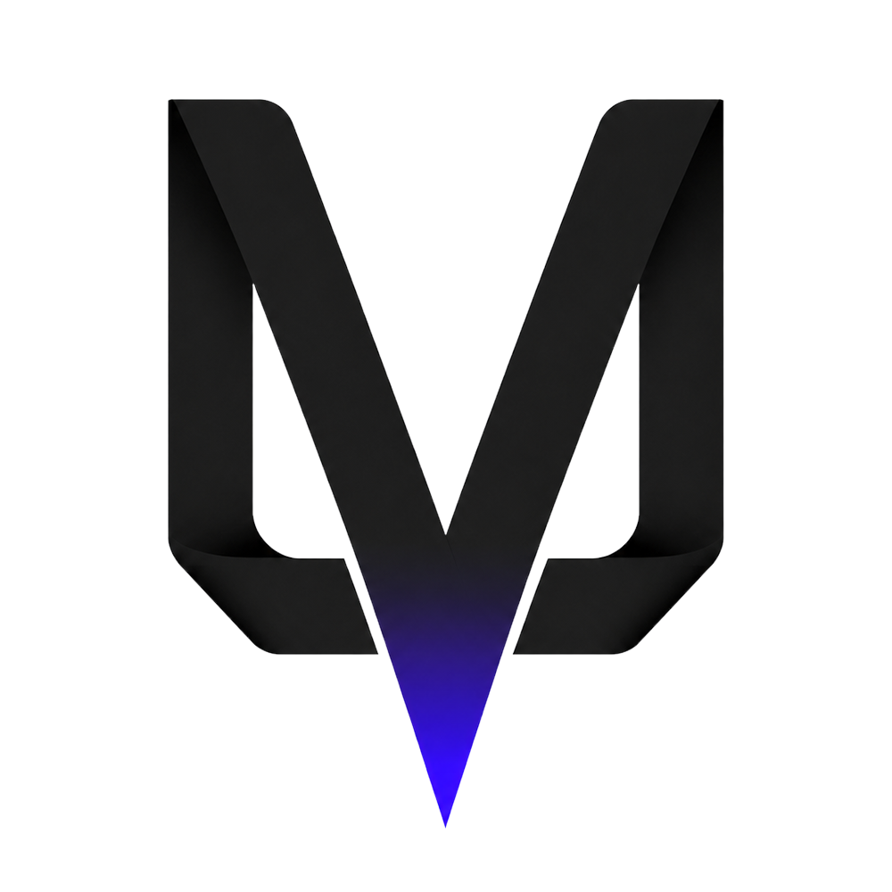

<p align="center">
  <picture>
    <source
      media="(prefers-color-scheme: dark)"
      srcset=".github/assets/ultraviolet_darkmode_transparent.png"
    >
    <source
      media="(prefers-color-scheme: light)"
      srcset=".github/assets/ultraviolet_lightmode_transparent.png"
    >
    
  </picture>
</p>

# Ultraviolet

[](LICENSE.md)
[](https://github.com/blacklight-foundation/ultraviolet/releases)
**Platform Status:** [](https://github.com/blacklight-foundation/ultraviolet/actions/workflows/hello-verification-linux.yml?query=branch%3Amain) [](https://github.com/blacklight-foundation/ultraviolet/actions/workflows/hello-verification-macos.yml?query=branch%3Amain) [](https://github.com/blacklight-foundation/ultraviolet/actions/workflows/hello-verification-windows.yml?query=branch%3Amain)

Ultraviolet is a general-purpose systems programming language designed for **explicit authority**, **predictable execution behavior**, and **source code legibility** practical for code written by humans, generated by AI systems, and reviewed by humans.

The repository contains the language specification, bootstrap compiler, runtime libraries, developer tooling, and the conformance verification suite.

Ultraviolet is public alpha software. It is ready for inspection, early
experimentation, specification review, conformance work, and compiler/runtime
contributions. Do not treat it as a mature production dependency.

---

## Design Philosophy

Ultraviolet is structured around a small set of foundational rules that eliminate hidden costs and ambient risks:

1. **One Correct Way**: Each semantic operation has exactly one accepted source form, unless alternate syntax changes capability, authority, ownership, synchronization, ABI behavior, or diagnostics.
2. **Local Reasoning**: Mutability, authority, synchronization, movement, suspension, and dynamic checks are fully visible from the local syntax and the referenced procedure or type signature.
3. **Explicit over Implicit**: Source constructs never conceal observable side effects, allocations, memory copy operations, synchronization blocks, suspension points, or unsafe behaviors.
4. **Static by Default**: Strict static compilation checks are the default; dynamic verification, dispatch, allocation, copying, and foreign trust boundaries require explicit opt-in.

---

## Language Highlights & Examples

### 1. Capability-Based Authority (No Ambient Effects)
External side effects (I/O, network, system commands) require an explicit capability handle, typically introduced via the program's `Context` parameter.

```ultraviolet
public procedure main(ctx: Context) -> i32 {
    let io: $IO = ctx.io

    // Explicit dynamic effect invocation using the capability call operator (~>)
    let write_result: Outcome<(), IoError> = io~>write_file(
        "output.txt",
        bytes::view_string("Hello, Ultraviolet!")
    )

    return if write_result is {
        @Value { 0 }
        @Error { 1 }
    }
}
```

### 2. Modal Types (First-Class Typestate)
State machines, connection protocols, and resource lifecycles are modeled directly using state-specific fields, procedures, and transitions.

```ultraviolet
public modal Connection {
    @Closed {
        public transition connect(address: string@View) -> @Connected {
            // Transitions connection into the @Connected state
            return Connection@Connected { address: address }
        }
    }

    @Connected {
        public address: string@View

        public procedure send(~, data: bytes@View) -> bool {
            // Sending is only valid and accessible in the @Connected state
            return true
        }

        public transition disconnect() -> @Closed {
            return Connection@Closed {}
        }
    }
}
```

### 3. Scoped Memory (Arena & Frame Allocators)
Arena memory management is built directly into the language surface. Frames allow cheap, nested allocations that are automatically reclaimed upon scope exit.

```ultraviolet
public procedure processData() -> i32 {
    var sum: i32 = 0
    region as scratch {
        // Allocate a value directly into the scratch region arena
        let temp_array: Ptr<[i32; 3]> = scratch ^ [1, 2, 3]

        // Scope-bound frame block allocates on a stack-like structure
        frame {
            let local_val: i32 = ^10
            sum = local_val + temp_array[0]
        } // Frame allocation is instantly reclaimed here
    } // Entire scratch region is reclaimed here
    return sum
}
```

### 4. Concurrency
Shared memory across execution domains is governed by a **Static Key System** built directly into Ultraviolet's type system. Rather than relying on runtime mutexes or unsafe manual synchronization, shared variables (`shared T`) require static key acquisition.

* **Key Propagation**: Passing a `shared` parameter propagates key authority up the call stack, avoiding inline block overhead.
* **Key Acquisition**: Precise access boundaries can be declared using `%read` and `%write` blocks.
* **Structured Concurrency**: Spawning asynchronously is managed with the `spawn` and `wait` primitives within execution domains (e.g. `parallel context~>cpu()`), and loops are parallelized using `dispatch` blocks.
* **Async Task States**: Async tasks are compiled into modal state machines with explicit, zero-cost suspension and resumption.

```ultraviolet
// Key authority is propagated statically via the 'shared' parameter signature
public procedure worker(counter: shared i32) -> i32 {
    var observed: i32 = 0
    %write counter {
        counter = counter + 1
        observed = counter
    }
    return observed
}

public procedure runConcurrency(context: Context) -> i32 {
    var counter: shared i32 = 0

    // Structured parallel execution domain (CPU threadpool)
    return parallel context~>cpu() {
        // Spawn concurrent tasks
        let task_a: Spawned<i32> = spawn [name: "worker-a"] {
            worker(counter)
        }
        let task_b: Spawned<i32> = spawn [name: "worker-b"] {
            worker(counter)
        }

        // Statically structured await
        (wait task_a) + (wait task_b)
    }
}
```

---

## Project Organization

The repository is organized into three major sections:

* [Docs/](Docs/): Contains the formal [Language Specification](Docs/SPECIFICATION.md), the source of truth for syntax, static/dynamic semantics, and ABI rules.
* [Bootstrap/Ultraviolet/](Bootstrap/Ultraviolet/): The C++ implementation of the bootstrap compiler, runtime libraries, and linker integrations.
* [HelloUltraviolet/](HelloUltraviolet/): A standalone conformance corpus and test reference surface containing physical fixtures, rejected/accepted specimens, and diagnostic audits.

## Supported Public Alpha Targets

| Host platform           | Target profile   | Release archive                    |
| ----------------------- | ---------------- | ---------------------------------- |
| Linux x86_64            | `x86_64-sysv`    | `ultraviolet-linux-x86_64.tar.gz`  |
| Apple Silicon macOS 14+ | `aarch64-darwin` | `ultraviolet-macos-aarch64.tar.gz` |
| Windows x86_64          | `x86_64-win64`   | `ultraviolet-windows-x86_64.zip`   |

---

## Installing the Compiler

Public alpha release builds can be installed from the command line. The default
install command is `uv`. If Python's `uv` package manager is already detected,
the installer asks before taking over `uv`.

Current public alpha release:
[`v0.1.0-alpha`](https://github.com/blacklight-foundation/ultraviolet/releases/tag/v0.1.0-alpha).

The `ultraviolet-lang.org` short URLs are the intended stable install
entrypoints once public site routing is available. The GitHub raw URLs below are
the release-pinned fallback and install the `v0.1.0-alpha` archive explicitly.

Linux or Apple Silicon macOS, pinned to `v0.1.0-alpha`:

```bash
release=v0.1.0-alpha
curl -fsSL "https://raw.githubusercontent.com/blacklight-foundation/ultraviolet/${release}/Tools/InstallUltraviolet.sh" \
    | sh -s -- --version "$release"
```

Windows PowerShell, pinned to `v0.1.0-alpha`:

```powershell
$release = "v0.1.0-alpha"
$script = irm "https://raw.githubusercontent.com/blacklight-foundation/ultraviolet/$release/Tools/InstallUltraviolet.ps1"
& ([scriptblock]::Create($script)) -Version $release
```

The root `install.sh` and `install.ps1` bootstrap entrypoints intentionally
default to `ULTRAVIOLET_INSTALL_REF=main` so stable URLs can receive installer
fixes without changing the release archive selected by the installer. For a
fully pinned bootstrap path, set both the bootstrap ref and installer version:

```bash
release=v0.1.0-alpha
curl -fsSL "https://raw.githubusercontent.com/blacklight-foundation/ultraviolet/${release}/install.sh" \
    | ULTRAVIOLET_INSTALL_REF="$release" \
      ULTRAVIOLET_INSTALL_VERSION="$release" \
      sh
```

```powershell
$release = "v0.1.0-alpha"
$env:ULTRAVIOLET_INSTALL_REF = $release
$env:ULTRAVIOLET_INSTALL_VERSION = $release
irm "https://raw.githubusercontent.com/blacklight-foundation/ultraviolet/$release/install.ps1" | iex
```

The installers place the compiler package under the user profile and add a small
shim directory to the user `PATH` by default:

* Linux package: `$HOME/.ultraviolet/current`
* Linux shims: `$HOME/.ultraviolet/bin`
* macOS package: `$HOME/.ultraviolet/current`
* macOS shims: `$HOME/.ultraviolet/bin`
* Windows package: `%LOCALAPPDATA%\Ultraviolet\current`
* Windows shims: `%LOCALAPPDATA%\Ultraviolet\bin`

If Python `uv` is already installed, the recommended interactive choice is to
install Ultraviolet as `uv` and preserve the existing Python command as `pyuv`.
Noninteractive conflict installs use `uvc` unless the command mode is specified.

Linux recommended `uv`/`pyuv` layout:

```bash
release=v0.1.0-alpha
curl -fsSL "https://raw.githubusercontent.com/blacklight-foundation/ultraviolet/${release}/Tools/InstallUltraviolet.sh" \
    | sh -s -- --version "$release" --use-uv
```

macOS uses the same shell installer. Apple Silicon hosts require Xcode Command
Line Tools so the packaged `clang++` driver can resolve the active SDK.

Windows recommended `uv`/`pyuv` layout:

```powershell
$release = "v0.1.0-alpha"
$script = irm "https://raw.githubusercontent.com/blacklight-foundation/ultraviolet/$release/Tools/InstallUltraviolet.ps1"
& ([scriptblock]::Create($script)) -Version $release -UseUv
```

To avoid modifying `PATH`, pass `--no-path` on Linux or set
`$env:ULTRAVIOLET_INSTALL_NO_PATH = "1"` before running the Windows installer.

Release maintainers generate the archives consumed by the installers with:

```bash
python3 Tools/PackageRelease.py --check-release-assets
python3 Tools/PackageRelease.py --platform all
```

Packaging copies only the manifest-listed release payload for each platform; it
does not treat every file in the CMake `out` directory as release content.
Archive metadata is normalized so unchanged payload bytes produce stable release
hashes. The release asset check verifies that the standalone installers still
request the archive names declared by the package manifest.
Local archive install probes verify the generated `.sha256` sidecar before
extracting the archive, matching the public download path.

The public release must attach these files:

* `ultraviolet-linux-x86_64.tar.gz`
* `ultraviolet-linux-x86_64.tar.gz.sha256`
* `ultraviolet-macos-aarch64.tar.gz`
* `ultraviolet-macos-aarch64.tar.gz.sha256`
* `ultraviolet-windows-x86_64.zip`
* `ultraviolet-windows-x86_64.zip.sha256`

Compiler release automation is label-driven. A merged PR with exactly one of
these labels controls the next main-branch release after Linux, macOS, and
Windows HelloUltraviolet verification pass for the same commit:

* `release: none` - publish no compiler release.
* `release: canary` - build validation workflow artifacts with a canary version
  such as `0.1.1-alpha.20260528.7f64337`; no GitHub Release or tag is created.
* `release: patch` - publish the next patch alpha such as `v0.1.1-alpha`.
* `release: minor` - publish the next alpha line such as `v0.2.0-alpha`.
* `release: breaking` - publish the next alpha line and call out the breakage in
  release notes.

Compiler release tags use the `v*` namespace for patch and minor alpha releases.
Extern payload releases use the `externs-*` namespace and are intentionally
separate.

---

## Building the Compiler from Source

The bootstrap compiler is written in C++ and built using CMake.

### Prerequisites
* **Windows**: Visual Studio 2022 with C++ support, CMake 4.0.1+, Python 3
* **Linux**: GCC/Clang, Make, CMake 4.0.1+, Python 3
* **macOS**: Apple Silicon Mac, Xcode Command Line Tools, CMake 4.0.1+, Python 3
* **Repository checkout**: extern payloads restored with `Tools/FetchTargetExterns.py`

The macOS source build uses the same vendored-payload model as Linux and
Windows. Before configuring, restore the payloads for the target host:

```bash
python3 Tools/FetchTargetExterns.py --target-profile x86_64-sysv
# macOS: python3 Tools/FetchTargetExterns.py --target-profile aarch64-darwin
```

```powershell
py -3 Tools\FetchTargetExterns.py --target-profile x86_64-win64
```

The macOS fetch restores:

* `Bootstrap/extern/llvm/llvm-21.1.8-aarch64-darwin`
* `Bootstrap/extern/icu/macos`

The package step copies the required macOS LLVM tools and ICU dylibs from those
`Bootstrap/extern` roots into `Bootstrap/Ultraviolet/build/macos/out/macos/*`.

### Build Steps

1. Configure the project:
   ```bash
   cd Bootstrap/Ultraviolet
   cmake --preset linux-release
   # macOS: cmake --preset macos-release
   # Windows: cmake --preset windows-release
   ```

2. Build and stage the release package:
   ```bash
   cmake --build --preset linux-release-package
   # macOS: cmake --build --preset macos-release-package
   # Windows: cmake --build --preset windows-release-package
   ```

Upon completion, the compiled command-line compiler is staged as `uv.exe`
(Windows) or `uv` (Linux/macOS) under the preset build directory:
* Windows: `Bootstrap/Ultraviolet/build/windows/out/uv.exe`
* Linux: `Bootstrap/Ultraviolet/build/linux/out/uv`
* macOS: `Bootstrap/Ultraviolet/build/macos/out/uv`

---

## Getting Started with Ultraviolet Projects

Once the `uv` compiler is on your path, you can create and build projects.

### 1. Initialize a Project
Create a new directory and initialize a minimal Ultraviolet project structure:
```bash
uv init my_project
cd my_project
```
This generates the standard layout:
```text
Ultraviolet.toml
Source/
  Main.uv
```

### 2. Build the Project
To compile your project, you must explicitly specify a **Target Profile** using the `--target-profile` CLI flag (or configure it in the `Ultraviolet.toml` manifest under `[toolchain].target_profile`):

```bash
uv build --target-profile x86_64-sysv  # Linux
uv build --target-profile aarch64-darwin # Apple Silicon macOS
uv build --target-profile x86_64-win64 # Windows
```

### 3. Run Project Tests
Ultraviolet supports native unit tests defined using `#test` blocks inside your code. Run them using:
```bash
uv test --target-profile x86_64-sysv
# macOS: uv test --target-profile aarch64-darwin
```

---

## Conformance & Conformance Testing

The [HelloUltraviolet](HelloUltraviolet/) directory is the release conformance surface for compiler and runtime behaviors. It acts as an integration-level gate before compiler updates are merged.

For public-alpha verification, run the verification runner from the repository root.
The verification checks the generated obligation ledger, generated HelloUltraviolet
catalog, package build, `uv build --check`, `uv build`, the executable corpus,
the audit corpus, source-native `#test` procedures, and the platform release
archive install probe. On macOS it also validates Mach-O arm64 artifacts,
packaged LLVM sidecar tools, bundled dylib load names, and required LC_RPATH
entries with `file`, `otool -L`, and `otool -l`.

On Linux:

```bash
python3 Tools/RunHelloVerification.py --target-profile x86_64-sysv
```

On Apple Silicon macOS:

```bash
python3 Tools/RunHelloVerification.py --target-profile aarch64-darwin
```

On Windows, use an actual Windows Visual Studio Developer PowerShell:

```powershell
py -3 Tools\RunHelloVerification.py --target-profile x86_64-win64
```

A successful public-alpha verification ends with:

```text
Verification result: PASS
Verification transcript SHA256: ...
```

Do not use `ctest` as the release conformance gate. HelloUltraviolet is the
test suite for compiler and runtime behavior.

Manual diagnostic runs are still possible after a compiler package has been
staged:

```bash
./Bootstrap/Ultraviolet/build/linux/out/uv build HelloUltraviolet \
    --target-profile x86_64-sysv
./HelloUltraviolet/Build/Binary/HelloUltraviolet
./HelloUltraviolet/Build/Binary/HelloUltraviolet --audit
./Bootstrap/Ultraviolet/build/linux/out/uv test HelloUltraviolet \
    --target-profile x86_64-sysv
```

On macOS, use `Bootstrap/Ultraviolet/build/macos/out/uv` and
`--target-profile aarch64-darwin`. The full verification also builds the macOS
artifact fixture projects before validation so executable, static archive,
hosted dylib, and external dylib import outputs are present and verified. To
run the macOS artifact validation gate directly after a build, use:

```bash
python3 Tools/VerifyReleaseArtifacts.py --platform macos
```

---

## Community & Support

- Questions: [GitHub Discussions](https://github.com/blacklight-foundation/ultraviolet/discussions)
- Direct contact: [contact@blacklight.foundation](mailto:contact@blacklight.foundation)
- Updates: [@blacklight_fdn on X](https://x.com/blacklight_fdn)
- Contributing: [CONTRIBUTING.md](CONTRIBUTING.md)
- Security vulnerabilities: [SECURITY.md](SECURITY.md)
- Code of conduct: [CODE_OF_CONDUCT.md](CODE_OF_CONDUCT.md)
- Sponsorship: [ultraviolet-lang.org/sponsor](https://ultraviolet-lang.org/sponsor/)

---

## License

Ultraviolet is licensed under the Apache License, Version 2.0. See [LICENSE.md](LICENSE.md) for details.
